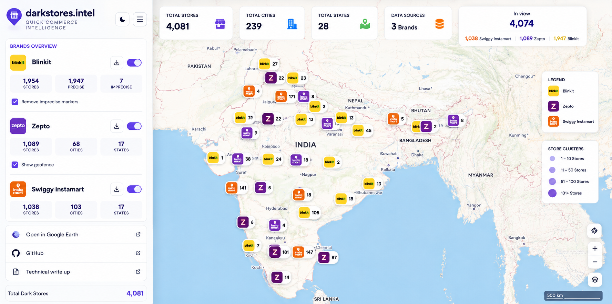
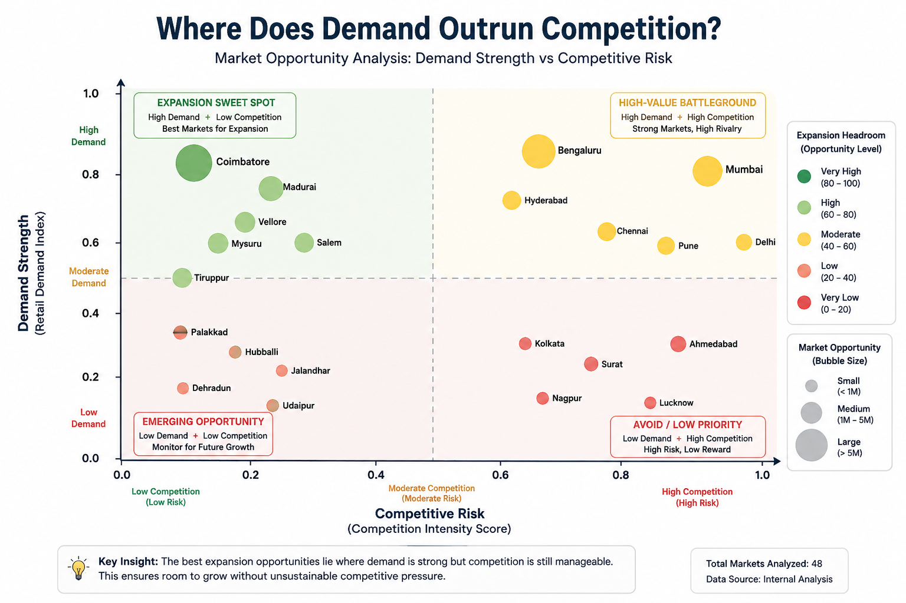
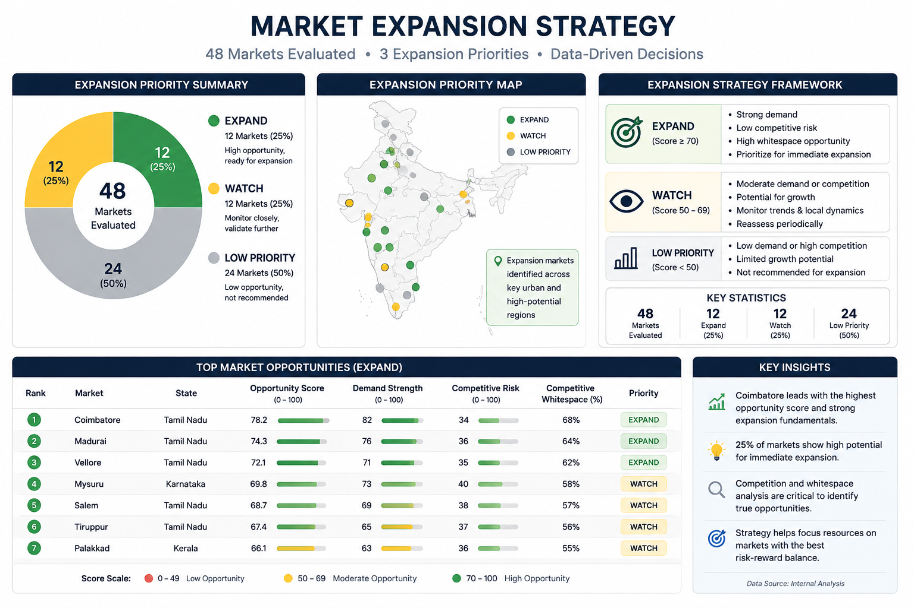
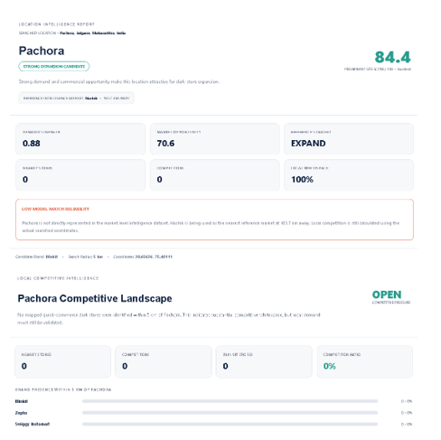
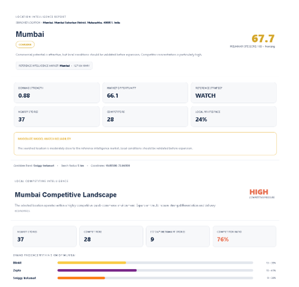

# Quick-Commerce Location Intelligence & Expansion Strategy

> A geospatial decision-support system for identifying high-potential dark-store expansion locations across India.

## Project Overview

Quick-commerce expansion is not simply about finding high-demand cities. A market may have strong demand but still be unattractive due to **intense competition, store saturation, or limited competitive whitespace**.

This project analyzes the observed networks of **Blinkit, Zepto, and Swiggy Instamart** to answer:

> **Where should a quick-commerce brand expand next?**

The system combines **demand, competition, brand strength, store density, and geospatial intelligence** to identify commercially attractive expansion opportunities.

---

## Project Snapshot

| Metric | Scale |
|---|---:|
| Dark Stores Analyzed | **4,081** |
| Brands | **3** |
| Decision-Ready Locations | **3,232** |
| Markets Evaluated | **48** |
| Expansion Markets | **12** |
| Final Output | **Interactive Location Intelligence Engine** |

---

## Tech Stack

`Python` `Pandas` `NumPy` `GeoPandas` `OpenStreetMap` `Plotly` `Jupyter Notebook` `Geospatial Analytics`

---

## 1. Understanding the Market

The project begins by mapping **4,081 dark-store locations** across Blinkit, Zepto, and Swiggy Instamart.

- **Blinkit:** 1,954
- **Zepto:** 1,089
- **Swiggy Instamart:** 1,038

The analysis showed that **national market leadership does not necessarily translate into local dominance**.



---

## 2. Finding Expansion Opportunity

Population alone was not enough to identify attractive markets.

A **Retail Demand Index** was combined with local competitive indicators including:

- Competitor pressure
- Brand share
- Store density
- Competitive whitespace

The core business logic became:

> **Strong Demand + Competitive Whitespace = Expansion Opportunity**



---

## 3. Location Opportunity Scoring

A **Location Opportunity Score / 100** was created using:

| Factor | Weight |
|---|---:|
| Demand Strength | **40%** |
| Competition Opportunity | **20%** |
| Competitor Pressure | **15%** |
| Local Brand Strength | **15%** |
| Density Opportunity | **10%** |

This produced **3,232 decision-ready locations**.

The rankings were also tested under **Balanced, Demand-Focused, and Low-Competition strategies** to evaluate their stability.

---

## 4. Expansion Strategy

The final market model evaluated **48 markets**:

| Strategy | Markets |
|---|---:|
| 🟢 **EXPAND** | **12** |
| 🟡 **WATCH** | **12** |
| ⚪ **LOW PRIORITY** | **24** |

Only **25% of evaluated markets** qualified for immediate expansion priority.

Key markets included:

- **Coimbatore** — #1 baseline opportunity
- **Madurai** — strong ranking stability
- **Vellore** — strong and stable
- **Palakkad** — attractive under a low-competition strategy



### Key Insight

> **High demand does not automatically mean high expansion potential. Competition determines how much opportunity remains.**

---

## 5. Interactive Location Intelligence Engine

The final notebook converts the analysis into an interactive **site-screening system**.

### Input

`Location / Coordinates` + `Brand` + `Search Radius`

### Output

`Site Score` • `Demand Strength` • `Market Opportunity` • `Nearby Stores` • `Competitors` • `Whitespace` • `Strategy` • `Reliability`

The engine allows users to evaluate a specific Indian location rather than relying only on market-level rankings.

---

# Case Studies

## 🟢 Pachora, Maharashtra — Expansion Opportunity

**Brand:** Blinkit  
**Preliminary Site Score:** **84.4 / 100**  
**Model Outcome:** **Strong Expansion Candidate**

The engine detected **0 mapped dark stores within 5 km**, resulting in **100% competitive whitespace**.

This indicates potential first-mover opportunity. However, Pachora uses Nashik as its nearest reference intelligence market, so the result requires further local demand validation.

**Decision:** **High-potential candidate for detailed feasibility analysis.**



---

## 🟡 Mumbai, Maharashtra — Competitive Market

**Brand:** Swiggy Instamart  
**Preliminary Site Score:** **67.7 / 100**  
**Model Outcome:** **Consider / Watch**

Mumbai showed strong demand, but the selected 5 km catchment contained:

- **37 nearby dark stores**
- **28 competitors**
- **76% competitor ratio**
- Only **24% local whitespace**

Despite attractive demand, the location operates within a highly competitive quick-commerce environment.

**Decision:** **Promising demand, but expansion requires stronger differentiation and further validation.**



---

## Business Value

The project transforms:

> **4,081 Stores → 3,232 Scored Locations → 48 Markets → 12 Expansion Priorities → Site-Level Recommendations**

The framework can support:

- Market screening
- Competitive intelligence
- Expansion prioritization
- Whitespace identification
- Candidate-site evaluation

---

## Repository Structure

```text
quick-commerce-location-intelligence/
│
├── Notebooks/
│   ├── 01_data_ingestion.ipynb
│   ├── 02_Data_Cleaning_&_Validation.ipynb
│   ├── 03_Exploratory_Data_Analysis_(EDA).ipynb
│   ├── 04_Census_Analysis_and_Retail_Demand_Index.ipynb
│   ├── 05_OpenStreetMap_Feature_Extraction.ipynb
│   ├── 06_Feature_Engineering.ipynb
│   ├── 07_Location_Opportunity_Engineering.ipynb
│   ├── 08_Location_Opportunity_Scoring_Model.ipynb
│   ├── 09_Market_Segmentation_&_Expansion_Strategy.ipynb
│   └── 10_Interactive_Location_Intelligence_Engine.ipynb
│
├── Reports/
│   └── Project documentation
│
├── dataset/
│   └── Project datasets
│
├── output/
│   ├── Output study.docx
│   └── Screenshots/
│       ├── case_study_mumbai.png
│       ├── case_study_pachora.png
│       ├── demand_vs_competition.png
│       ├── india_dark_store_network.png
│       └── market_expansion_strategy.png
│
├── presentation/
│   └── Project presentation
│
└── README.md
```

---

## Limitations

The model provides **strategic site-screening intelligence rather than guaranteed profitability**.

Final expansion decisions should additionally consider:

- Actual order demand
- Property rent
- Delivery economics
- Rider availability
- Traffic and accessibility
- Operating costs
- Real-time competitor activity

---

## Conclusion

This project moves beyond asking:

> **"Where is demand highest?"**

and instead asks:

> ### **"Where is commercially attractive demand still available?"**

The result is an end-to-end **geospatial decision-support system** that converts raw location data into actionable quick-commerce expansion recommendations.
